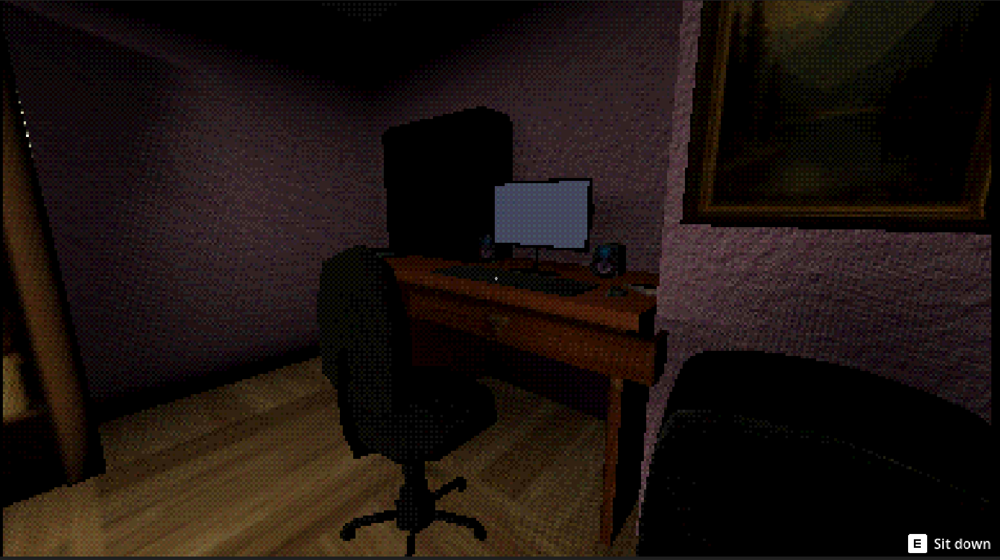
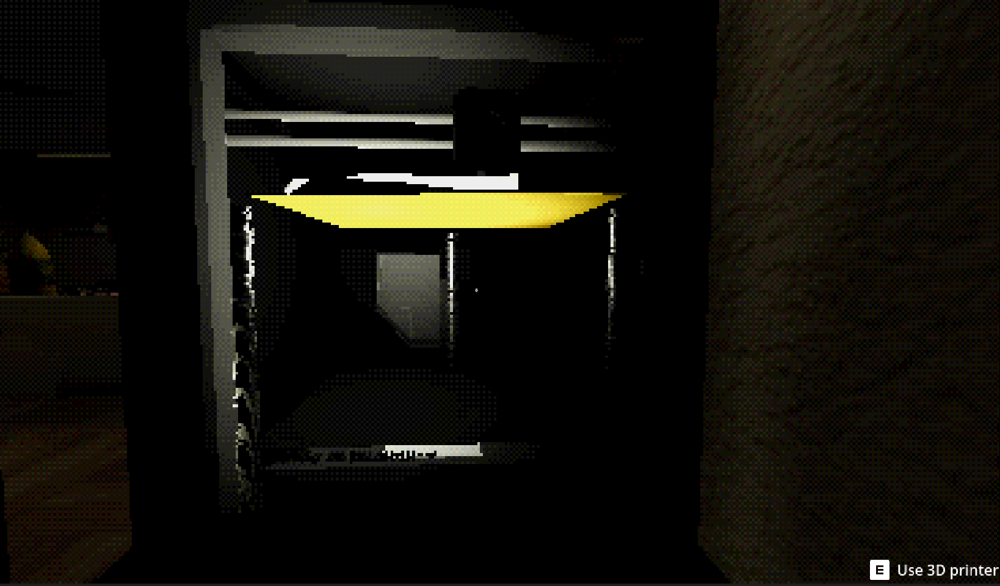
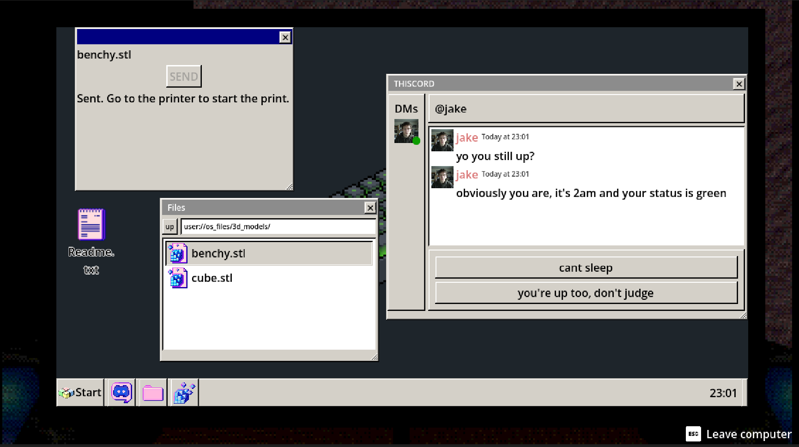
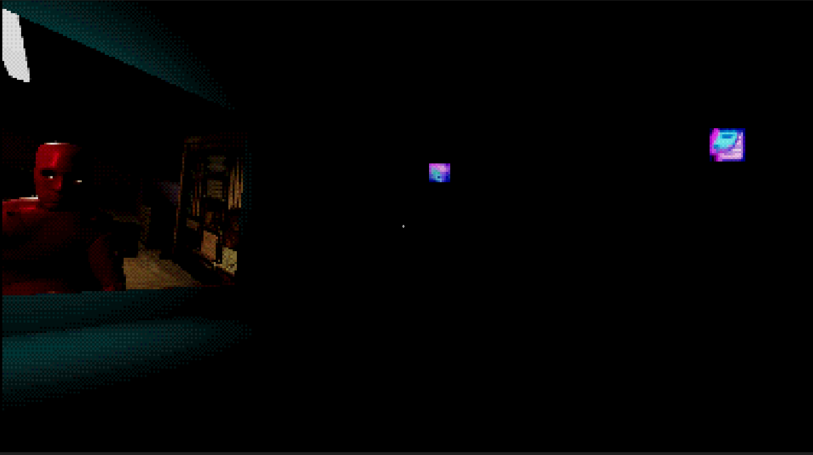

# DAEMON

*a friend messages u late at night asking for small favors. u never ask why.*

---

## About

its 2am. and your friend is online and wants you to print something.

DAEMON is a short first-person psychological horror about a 3D printer, a friend who wont stop messaging u, and a fake OS that is insprired by win 95. 

u spend most of the game just sitting at a desk checking messages sending files and waiting for prints to finish. its quiet and mundane and thats exactly the point.

made solo for [Hack Club Stardance](https://stardance.hackclub.com/)

## Screenshots

## Features

- fully simulated in-game OS. file explorer reads actual files from ur disk chat client mail and terminal all in classic win95 style
- working 3D printer with its own physics and sounds
- psx era low poly graphics and shaders 
- story told mostly through what ur "friend" messages u and what he leaves out

## Controls

| Key | Action |
|---|---|
| WASD | move |
| Mouse | look |
| E | interact |
| Left Click | grab objects |
| Tab + Mouse | rotate held object |
| C | take photo |
| Esc | leave computer |
| F11 | toggle fullscreen |

## Built with

Godot 4.7, GDScript

## Credits

full credits for assets sound and fonts are in the game menu. 
